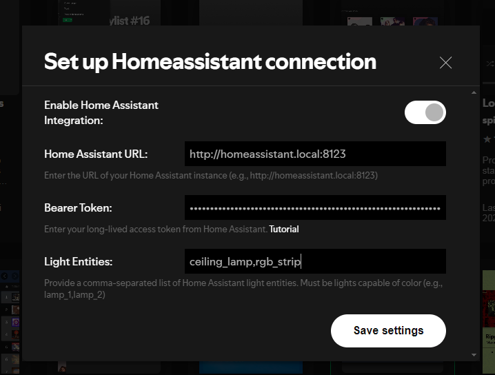

# Dynamic Lights Home Assistant

A [Spicetify](https://spicetify.app/) extension that dynamically sets your RGB lights to match the current album cover color using Home Assistant.

## Demo




## Prerequisites

- [Home Assistant](https://www.home-assistant.io/) set up and running
- [Spicetify](https://spicetify.app/) installed on your Spotify client
- RGB-capable smart lights connected to Home Assistant

## Setup Instructions

### 1. Home Assistant Configuration

1. Create a new automation in Home Assistant
2. Add a webhook trigger
3. Copy the Webhook ID (you'll need this later)
4. (Optional) Add conditions (e.g., only run 2 hours before sunset)
5. Add a `Light: Turn on` action
6. Select your light entities
7. Switch to the YAML editor (click the three dots)
8. Paste the following code:

   ```yaml
   data:
     rgb_color: "{{trigger.json.rgb}}"
   ```

> Note: You can modify the automation, but ensure you keep the `"{{trigger.json.rgb}}"` string intact.  
> Have a look at [automation-example.yaml](automation-example.yaml) for a full automation example

### 2. Spicetify Extension Installation

1. Install the extension using the Spicetify Marketplace
2. Configure the extension:
   - Click on your profile picture in the top right corner
   - Choose "Home Assistant Settings"
   - Fill in the required information:
     - **Home Assistant URL**: Your full Home Assistant URL (must start with `http://` or `https://`)
     - **Webhook ID**: The ID you copied from the Home Assistant automation
