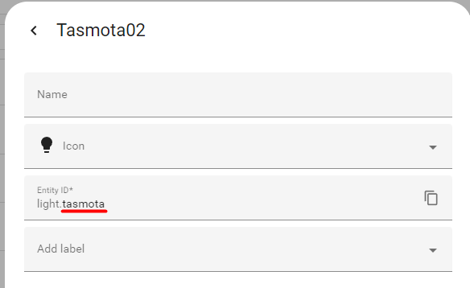

# Dynamic Lights Home Assistant

A [Spicetify](https://spicetify.app/) extension to set your RGB lights to the current album cover color using Home Assistant.

## Demo


## Setup

Install the extension using the [spicetify marketplace](https://github.com/spicetify/marketplace/) and configure it by clicking on your profile picture in the top right corner and choose "Home Assistant Settings".

### Home Assistant URL

This is your URL to Home Assistant. It has to start with `http://` or `https://`.

### Bearer Token

This is the token that allows the extension to talk to Home Assistant. Go to your HA profile, create a token and give it a proper name. See [here](https://community.home-assistant.io/t/how-to-get-long-lived-access-token/162159/5) for a better tutorial.

### Light Entities

This is a comma seperated list of lights that should change their color. Use the entity ID (without the `light.` prefix), not the display name.



#### Example

```
tasmota,wled,light_1
```
