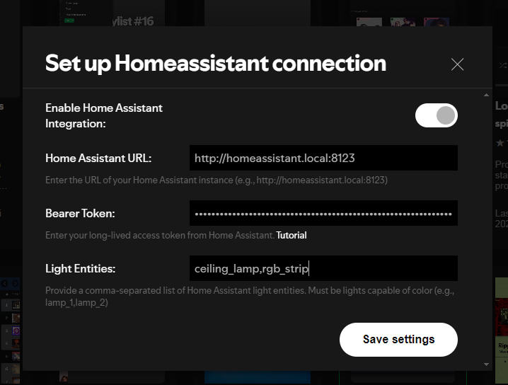

# Dynamic Lights Home Assistant

A [Spicetify](https://spicetify.app/) extension that dynamically sets your RGB lights to match the current album cover color using Home Assistant.

## Demo




## Prerequisites

- [Home Assistant](https://www.home-assistant.io/) set up and running **with a valid HTTPS URL**.
  - Watch [this video](https://www.youtube.com/watch?v=xXAwT9N-7Hw) to learn about an easy way to setup remote access and a valid SSL certificate for your Home Assistant instance
- [Spicetify](https://spicetify.app/) installed on your Spotify client
- RGB-capable smart lights connected to Home Assistant

## Setup Instructions

### 1. Home Assistant Configuration

1. Create a new automation in Home Assistant
2. Add a webhook trigger
3. Copy the Webhook ID (you'll need this later)
> [!WARNING]
> When copying the Webhook ID from Home Assistant's `Copy URL to clipboard` button, the **_ENTIRE URL_** is copied, not just the Webhook ID, resulting in a `Failed to change lights` error. Please double check you are _only_ copying the Webhook ID, and **not** the entire URL.
4. (Optional) Click on the cog icon on the right and uncheck the "Only accessible from the local network" option when using some external proxy (e.g. [Nabu Casa Cloud](https://www.nabucasa.com/) or [cloudflared](https://github.com/cloudflare/cloudflared))
5. (Optional) Add conditions (e.g., only run 2 hours before sunset)
6. Add a `Light: Turn on` action
7. Select your light entities
8. Switch to the YAML editor (click the three dots)
9. Paste the following code:

   ```yaml
   data:
     rgb_color: "{{trigger.json.rgb}}"
   ```

> [!NOTE]
>
> - You can modify the automation, but ensure you keep the `"{{trigger.json.rgb}}"` string intact.
> - Have a look at [automation-example.yaml](automation-example.yaml) for a full automation example.
> - When using Yeelight lamps, you may want to enable their [music mode](https://www.home-assistant.io/integrations/yeelight/#music-mode).

### 2. Spicetify Extension Installation

1. Install the extension using the Spicetify Marketplace
2. Configure the extension:
   - Click on your profile picture in the top right corner
   - Choose "Home Assistant Settings"
   - Fill in the required information:
     - **Home Assistant URL**: Your full Home Assistant URL (must start with `http://` or `https://`)
     - **Webhook ID**: The ID you copied from the Home Assistant automation
> [!CAUTION]
> Please make sure you are _**only**_ pasting the Webhook _**ID**_ and not the Webhook _**URL**_, this will result in a 'Failed to change lights' error.

## Local Development

### Building the Extension

1. Install dependencies:
   ```bash
   npm install
   ```

2. Start the watch mode for development (auto-rebuilds on file changes):
   ```bash
   npm run watch
   ```

3. The built files will be in the `dist/` folder.

### Installing Your Local Build

1. Make sure to uninstall the production extension from the marketplace (if installed)

2. Enable the extension in Spicetify:
   ```bash
   spicetify config extensions dynamic-lights-homeassistant.js
   spicetify apply
   ```

3. Restart Spotify if it's already running.

### Viewing Logs

The extension uses `console.debug()` for detailed logging and `console.error()` for errors.

1. **Open the DevTools** in Spotify:
   - Right-click anywhere in the Spotify window and select **"Inspect"**
   - Or use the keyboard shortcut: **Ctrl+Shift+I** (Windows/Linux) or **Cmd+Option+I** (macOS)

2. **Enable Debug Logs**:
   - Open the **Console** tab in DevTools
   - Click the **log level dropdown** at the top left (usually says "Default levels")
   - Check **"Verbose"** to see `console.debug()` messages
